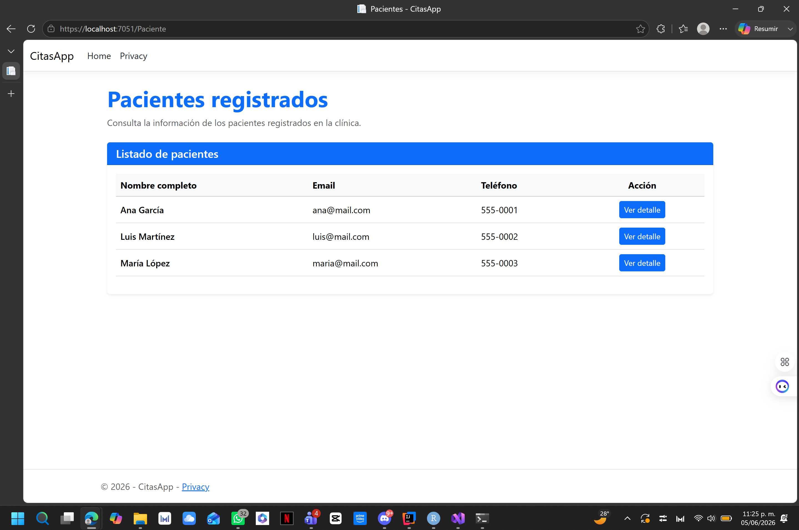
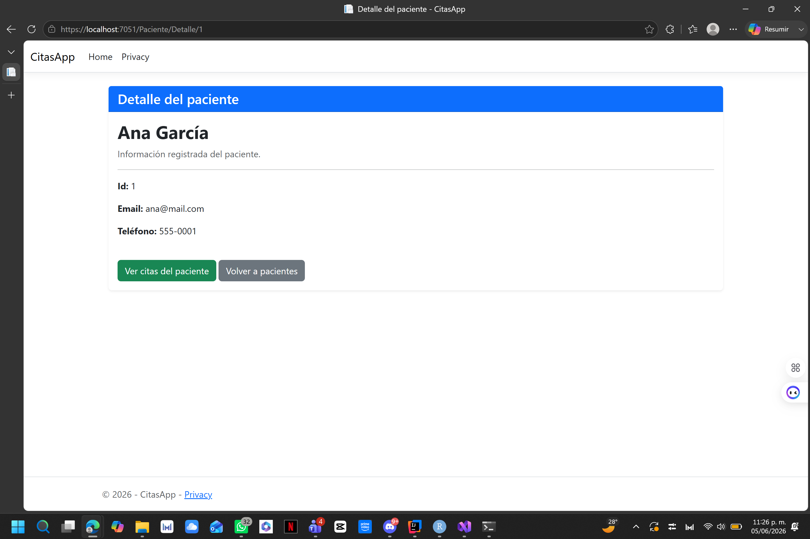
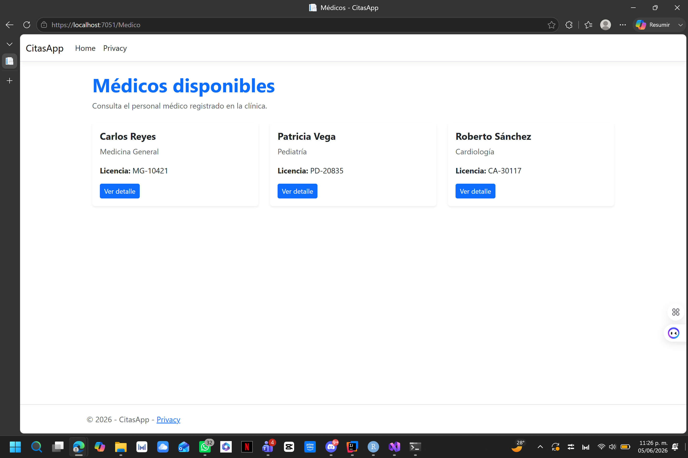
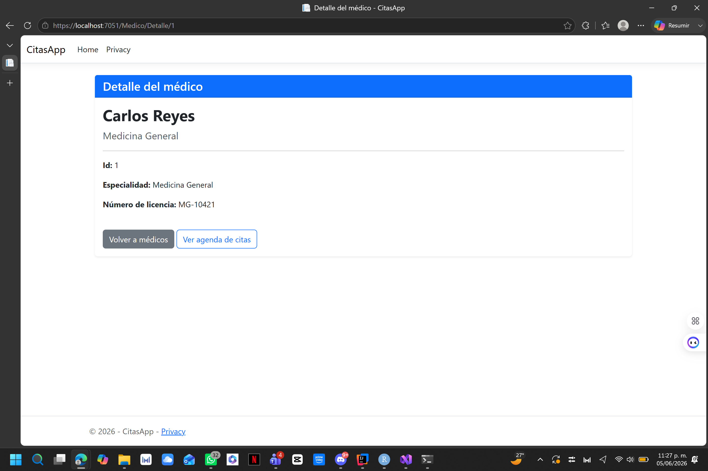
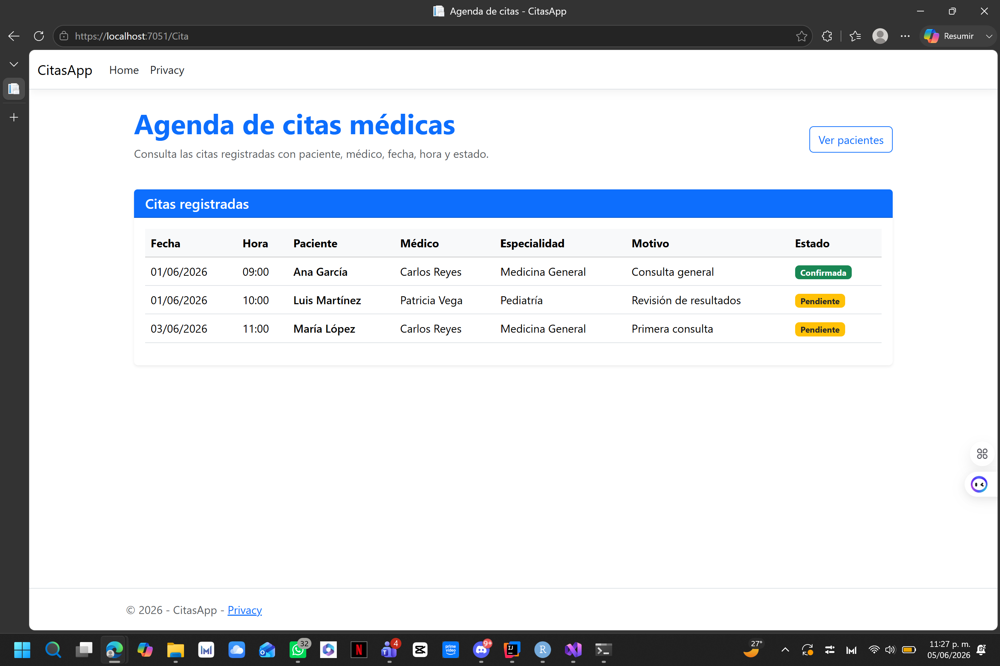
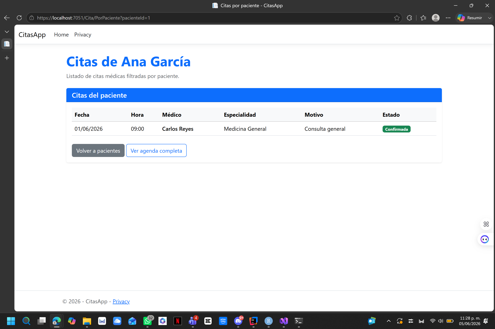

# CitasApp

## Descripción del proyecto

CitasApp es una aplicación web desarrollada con ASP.NET Core MVC para la gestión básica de citas médicas.

El sistema permite consultar pacientes registrados, médicos disponibles y una agenda de citas médicas. La información se maneja en memoria, por lo que no utiliza una base de datos en esta versión inicial.

Esta práctica tiene como objetivo implementar el patrón MVC, separando la aplicación en modelos, controladores y vistas.

## Tecnologías usadas

- C#
- ASP.NET Core MVC
- .NET
- Razor Views
- HTML
- CSS
- Bootstrap
- Visual Studio
- Git
- GitHub

## Funcionalidades

- Listar pacientes registrados.
- Ver el detalle de un paciente.
- Listar médicos disponibles.
- Ver el detalle de un médico.
- Mostrar la agenda completa de citas.
- Filtrar citas por paciente.
- Mostrar el nombre del paciente y del médico en cada cita.

## Estructura del proyecto

```text
CitasApp/
├── Controllers/
│   ├── PacienteController.cs
│   ├── MedicoController.cs
│   └── CitaController.cs
├── Data/
│   └── DatosMemoria.cs
├── Models/
│   ├── Paciente.cs
│   ├── Medico.cs
│   └── Cita.cs
├── ViewModels/
│   └── CitaViewModel.cs
├── Views/
│   ├── Paciente/
│   ├── Medico/
│   └── Cita/
└── Program.cs

## Capturas de pantalla

### Pacientes



### Detalle de paciente



### Médicos



### Detalle de médico



### Agenda de citas



### Detalle / citas por paciente

